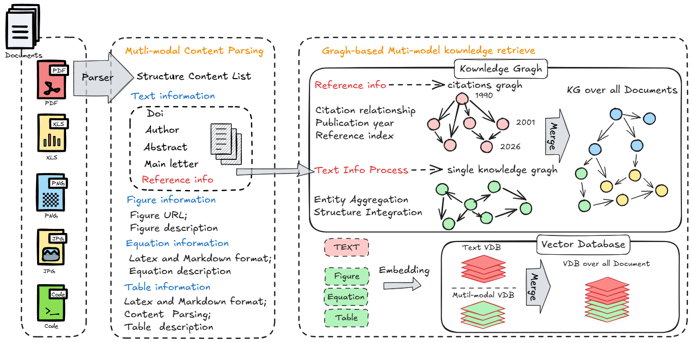
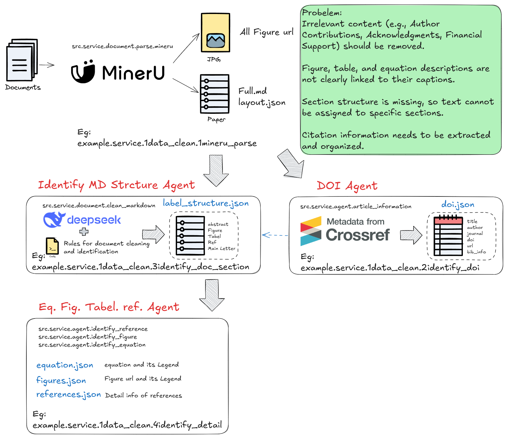

<h1 align="center">SchwarzRAG</h1>

<!-- <p align="center">
  <a href="./README.md">English</a> |
  <a href="./README_zh.md">简体中文</a>
</p> -->

<details open>
<summary><b>📕 Table of Contents</b></summary>

- 💡 [Project Overview](#-project-overview)
- 🔥 [Latest Updates](#-latest-updates)
- 🌟 [Quick Start](#-quick-start) 
- 🎉 [Key Features](#-key-features)
- 📜 [System Architecture](#-system-architecture)
- 🔎 [Technical Roadmap](#-technical-roadmap)
- 🙌 [Contributing](#-contributing)

</details>

## 💡 Project Overview

SchwarzRAG is an intelligent retrieval system built on deep document understanding, specializing in research evolution tracking, knowledge retrieval, and professional assistance for the Schwarz Crystal domain. As a vertical domain LLM application, it provides conversational interaction, intelligent agency, and information query capabilities.

## 🔥 Latest Updates

- 2026-03-07 complete text vector database construction and data clean; finish the fundamental functionality of the system like knowledge retrieval, web searching, and information query.

## 🌟 Quick Start

Need to install Python 3.10+, recommended to use Anaconda or Miniconda

```bash
conda create -n scirag python=3.10.19
```

The above command will create a new environment named scirag.

Then activate the environment:

```bash
conda activate scirag
```

Install dependencies ``requirements.txt``:

```bash
pip install -r requirements.txt
```

if using **api mode**, you can use the following command to start the server:

First, open the ``config.json`` file and add your API key:

```json
{
  "chatmodel": {
    "method": "api",   
    "name": "deepseek",
    "modelType": "deepseek-chat",
    "apiKey": "your_api_key"
  },

  "embedmodel": {
    "method": "api",
    "name": "aliyun",
    "modelType": "text-embedding-v1",
    "apiKey": "your_api_key"
  }
}
```

And run ```config.py``` to setting your API key

## 🌟 Key Features

### 🍭 Data Clean and Extract

- After paersing, the files inputted by the user will be turned into markdown format, which still exsit many noise. This step will help to clean the data and extract the essential information.

### 🌱 Scientific Evolution Knowledge Graph

- Construct Citation-Aware Scientific Knowledge Graph
- Based citation traceability with scientific letter, combine the knowledge graph and the citation graph.

### 🍔 Multi-Retrieve Strategy

- Support multiple retrieval strategies, and analyze the relevance of the retrieved information.


## 🔎 System Architecture



## 🎬 Technical Roadmap

### 📝 Data Parse and Clean (Initial Step)

- Parse model: MinerU
- Doi Agent
- Identify Agent for scientific articles



### 🚀 Localized High-Code Solution (Target Phase)

- Deployment: FastAPI + vLLM inference optimization
- Framework: LangChain agent orchestration
- Web App: Gradio/Streamlit interfaces
- Data Processing: RAGFlow Parser engine

## 🙌 Contributing

SchwarzRAG thrives through open-source collaboration. We welcome:
- Code contributions
- Domain knowledge expansion
- System testing & issue reporting
- Documentation translation & refinement